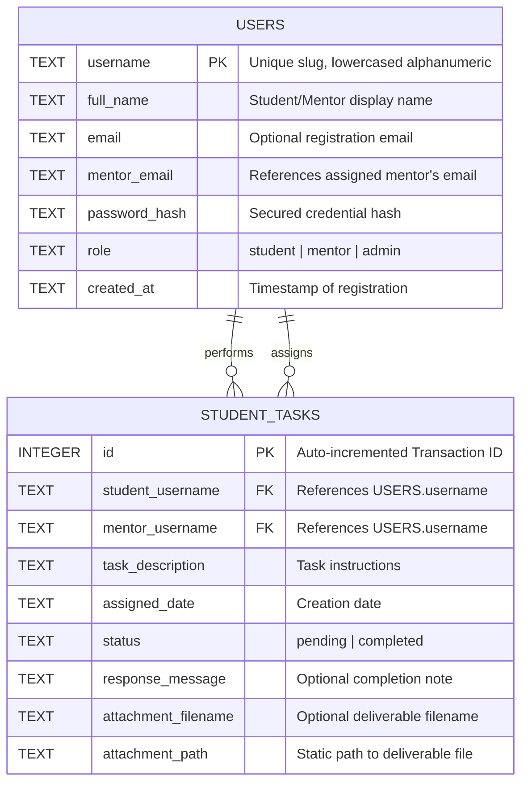
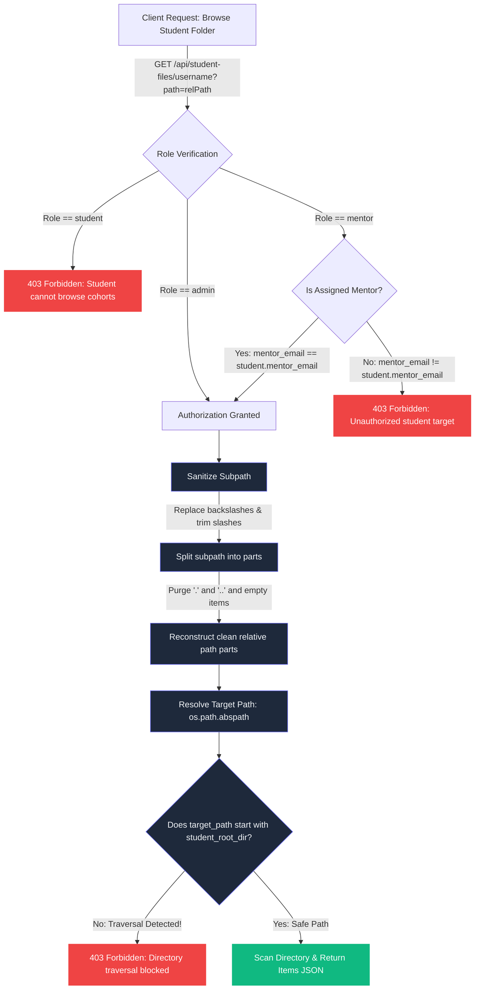

# LogiSync Technical Diagrams 📊

This document provides high-fidelity, professional technical diagrams illustrating the system architecture, database schema, data flow lifecycle, and security boundaries of the LogiSync portal.

---

## 1. 🖥️ System Architecture
The architecture is divided into three primary layers: the **Client Interface**, the **Flask Backend Gateway**, and the **External & Utility Services**.

```mermaid
graph TD
    subgraph Client Layer (Frontend)
        A[Glassmorphic HTML5 Dashboard] -->|Async AJAX Fetch/REST| B[Client Controllers: app.js / mentor.js / admin.js]
        B -->|Asynchronous Save on Blur| C[Dynamic Timeline & Form Grids]
    end

    subgraph Backend Core (Python / Flask Gateway)
        B -->|JSON Payload Routes| D[app.py Routing Gateway]
        D -->|decorators: @login_required| E[Auth & Session Managers]
        D -->|sys.path.insert modules| F[Encapsulated Services Layer]
    end

    subgraph Services & Persistence Layer
        F -->|SQLite Row Queries| G[(SQLite: users.db)]
        F -->|Direct Cell Manipulation| H[excel_manager.py: openpyxl]
        F -->|API Prompts / JSON| I[ai_service.py: Google Gemini API]
        F -->|SMTP smtplib TLS| J[mail_service.py: Mail Server]
    end

    subgraph Storage Vaults (Local disk)
        H -->|Compile & Save| K[excel_templates/username/Sandhata_Internship_Log.xlsx]
        D -->|Save Task Uploads| L[static/uploads/tasks/task_id/filename]
    end

    classDef client fill:#13273f,stroke:#14b8a6,stroke-width:2px,color:#f1f5f9;
    classDef backend fill:#142030,stroke:#6366f1,stroke-width:2px,color:#f1f5f9;
    classDef services fill:#0f172a,stroke:#f1f5f9,stroke-width:1px,color:#f1f5f9;
    classDef storage fill:#1e293b,stroke:#a7f3d0,stroke-width:1px,color:#f1f5f9;

    class A,B,C client;
    class D,E,F backend;
    class G,H,I,J services;
    class K,L storage;
```

---

## 2. 🗄️ Database Entity-Relationship Diagram (users.db)
The database utilizes a clean relational schema mapping user accounts, roles, and supervisor task delegations.



---

## 3. 🔄 Daily Log & Timesheet Lifecycle
The step-by-step lifecycle of daily logs, summary generation, and supervisor submission.

```mermaid
sequenceDiagram
    autonumber
    actor Student
    participant UI as Client Dashboard (JS)
    participant Core as app.py (Flask Gateway)
    participant Excel as excel_manager.py (openpyxl)
    participant AI as ai_service.py (Gemini LLM)
    participant Mail as mail_service.py (SMTP)
    actor Mentor

    Student->>UI: Enter Log Date & Load Sheets
    UI->>Core: POST /api/load-timesheet {date, arrival}
    Core->>Excel: get_or_create_day_slots()
    Excel-->>Core: Return formatted slots
    Core-->>UI: Render interactive work cards
    
    rect rgb(20, 32, 48)
        note right of Student: Hourly Editing & Auto-Save Loop
        Student->>UI: Types work achievements in card & clicks away
        UI->>Core: POST /api/save-slot {row, text}
        Core->>Excel: save_timesheet_slot_activity()
        Excel-->>Core: Cell saved & workbook flushed to disk
        Core-->>UI: Update indicator (Success Toast)
    end

    Student->>UI: Clicks "Generate AI Summary"
    UI->>Core: POST /api/generate-summary {date}
    Core->>Excel: get_activities_for_date()
    Excel-->>Core: Return text logs array
    Core->>AI: generate_daily_summary(activities)
    AI-->>Core: Return polished markdown text
    Core-->>UI: Render summary in text editor for preview

    Student->>UI: Clicks "Send Final Summary"
    UI->>Core: POST /api/send-summary {summary_text}
    Core->>Mail: send_summary_email(mentor_email, summary_text)
    Mail->>Mentor: Secure SMTP Email Delivered
    Mail-->>Core: Success Status
    Core-->>UI: Update Daily Checklist & Activities
```



---

## 🛡️ 4. Security & Folder Explorer Path Sanitization
Illustrates how the folder explorer blocks directory traversal attacks (`../`) and enforces role-based workspace boundaries.


