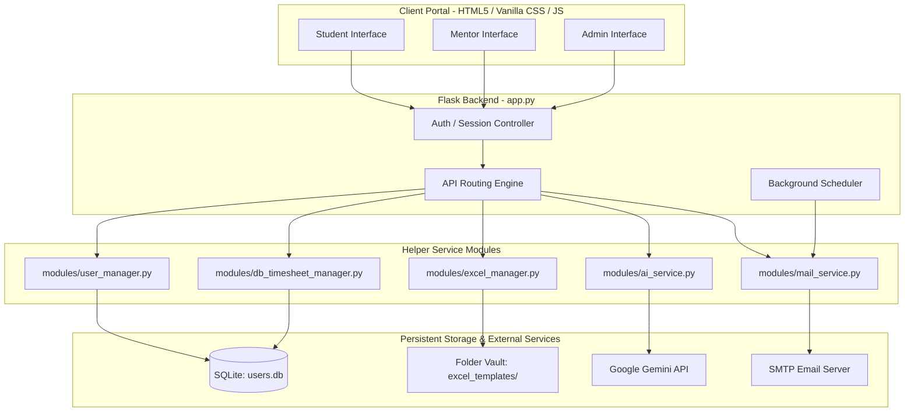

# Mentis.ai 🔄 — Project Technical Documentation

Mentis.ai is a secure, responsive, and feature-rich web application designed for tracking student internships, daily activity logs, task submissions, and mentor-student collaborations.

---

## 🏛️ System Architecture

Mentis.ai is built on a Flask web server, backed by SQLite, and integrated with the Google Gemini API (for daily summary generation) and SMTP (for mentor emails).



---

## 👥 User Roles & Core Features

### 1. Student Portal (`index.html`)
The student portal acts as the workspace for daily logging:
*   **Timesheet Tracker:** Log hourly work slots (Work vs. Lunch Breaks) with synced saving.
*   **Daily Checklist Progress:** A visual completion tracker that auto-checks when timesheet blocks are complete, pending tasks are resolved, and the AI Daily Summary is sent.
*   **Activity Timeline:** A persistent vertical chronological feed of all files uploaded, folder creation, task completions, and loaded configurations.
*   **AI Daily Summary:** Aggregates logged daily work logs, refines them using AI into a professional log summary, and emails it to the mentor.
*   **Internship Files Explorer:** Upload, view, and organize documents inside the student's secure folder vault.
*   **Mentor Tasks:** Access, review, and complete tasks assigned by mentors with attachments and response text.

### 2. Mentor Portal (`mentor.html`)
The mentor portal manages assigned students:
*   **My Students List:** View current students and check if their Excel logs are initialized.
*   **Student Log Viewer:** Browse individual timesheets and daily schedules.
*   **Task Assignment Board:** Assign tasks to specific students, track progress, review responses, and download attachments.
*   **Student Folder Browser:** Securely view and download documents uploaded by the student.

### 3. Admin Portal (`admin.html`)
The administrator acts as the supervisor:
*   **User Management:** Register and delete student and mentor accounts.
*   **Relationships Configuration:** Link student users to their respective mentors.
*   **Workspace Auto-Initialization:** Generate student workspace folders and default templates.

---

## 💾 Database Schema (`users.db`)

Mentis.ai runs on a SQLite database. The schema consists of four tables:

### 1. `users`
Stores user authentication details and role definitions.
```sql
CREATE TABLE users (
    id INTEGER PRIMARY KEY AUTOINCREMENT,
    username TEXT UNIQUE NOT NULL,      -- Clean alphanumeric username
    full_name TEXT NOT NULL,            -- Display name
    email TEXT DEFAULT '',              -- Email address
    mentor_email TEXT DEFAULT '',       -- Mapped mentor's email address
    password_hash TEXT NOT NULL,        -- Werkzeug salted password hash
    role TEXT NOT NULL DEFAULT 'student', -- 'student', 'mentor', or 'admin'
    created_at TEXT NOT NULL DEFAULT (datetime('now'))
);
```

### 2. `student_tasks`
Stores tasks assigned to students by mentors, including completion attachments.
```sql
CREATE TABLE student_tasks (
    id INTEGER PRIMARY KEY AUTOINCREMENT,
    student_username TEXT NOT NULL,     -- Mapped student
    mentor_username TEXT NOT NULL,      -- Assigning mentor
    task_description TEXT NOT NULL,     -- Task description
    assigned_date TEXT NOT NULL DEFAULT (date('now')),
    status TEXT NOT NULL DEFAULT 'pending', -- 'pending' or 'completed'
    response_message TEXT,              -- Text response submitted by student
    attachment_filename TEXT,           -- Filename of file attachment
    attachment_path TEXT,               -- Upload path under static/uploads/
    FOREIGN KEY (student_username) REFERENCES users(username) ON DELETE CASCADE,
    FOREIGN KEY (mentor_username) REFERENCES users(username) ON DELETE CASCADE
);
```

### 3. `timesheet_slots`
Stores the daily timesheet log entries.
```sql
CREATE TABLE timesheet_slots (
    id INTEGER PRIMARY KEY AUTOINCREMENT,
    username TEXT NOT NULL,             -- Student username
    date_val TEXT NOT NULL,             -- Date formatted as DD/MM/YYYY
    start_time TEXT NOT NULL,           -- Time string (e.g. 09:00)
    end_time TEXT NOT NULL,             -- Time string (e.g. 11:00)
    duration_hrs TEXT NOT NULL,         -- Decimal duration
    category TEXT NOT NULL,             -- 'Work' or 'Lunch Break'
    activity_text TEXT NOT NULL DEFAULT '', -- Description of work done
    row_index INTEGER NOT NULL,         -- Chronological index of slot
    FOREIGN KEY (username) REFERENCES users(username) ON DELETE CASCADE
);
```

### 4. `student_activities`
Tracks chronological logs of student operations for the activity feed and checklist.
```sql
CREATE TABLE student_activities (
    id INTEGER PRIMARY KEY AUTOINCREMENT,
    username TEXT NOT NULL,             -- Student username
    activity_type TEXT NOT NULL,        -- 'timesheet', 'file', 'task', or 'summary'
    action_text TEXT NOT NULL,          -- Action description
    detail_text TEXT,                   -- Meta details
    timestamp TEXT NOT NULL DEFAULT (datetime('now', 'localtime')),
    FOREIGN KEY (username) REFERENCES users(username) ON DELETE CASCADE
);
```

---

## 📡 API Endpoints

### 🔑 Authentication & Configuration
*   `POST /api/login` — Auths credentials. Saves `username`, `full_name`, and `role` to session.
*   `POST /api/register` — Registers a student account.
*   `GET /api/config` — Retrieves the active configurations.
*   `POST /api/config` — Saves date configurations.

### 📅 Timesheet Management
*   `POST /api/load-timesheet` — Retrieves or initializes slots for a date.
*   `POST /api/save-slot` — Saves the description text of a work block.
*   `GET /api/download-timesheet` — Exports all logged timesheet slots as a styled Excel workbook (`.xlsx`).

### 🤖 AI Summary & Emails
*   `POST /api/generate-summary` — Feeds slot logs into Gemini to craft a summary.
*   `POST /api/send-summary` — Sends the daily summary email to the assigned mentor.

### 📋 Mentor Tasks
*   `GET /api/student/tasks` — List of assigned mentor tasks.
*   `POST /api/student/tasks/<int:task_id>/complete` — Submits response message and optional file to mark a task as completed.

### 📁 Student File Explorer
*   `GET /api/student/files` — Lists items inside a student's secure folder vault.
*   `POST /api/student/files/create-folder` — Creates a subfolder in the student's vault.
*   `POST /api/student/files/upload` — Saves a file in the active folder path.
*   `DELETE /api/student/files/delete` — Removes a folder or file.
*   `GET /api/student/files/download` — Downloads a file from the vault.

### 🔔 Activity Feed & Checklist
*   `GET /api/student/activities` — Retrieves the list of persistent activities for the logged-in student.
*   `GET /api/student/checklist-status?date=YYYY-MM-DD` — Gets completion status for the daily checklist tasks.

---

## 🚀 Setting Up & Running Mentis.ai

### 📋 Prerequisites
*   Python 3.8+
*   Google Gemini API Key (configured in environment)
*   Google Account SMTP Credentials (optional, for emailing summaries)

### 1. Installation
Install the necessary python modules:
```bash
pip install flask openpyxl apscheduler werkzeug
```

### 2. Environment Configuration
Create a `.env` file in the project root directory:
```env
# Gemini API Engine
GEMINI_API_KEY=your_gemini_api_key_here

# Optional: SMTP Email configuration
SMTP_EMAIL=your_email@gmail.com
SMTP_PASSWORD=your_16_character_app_password
```

### 3. Startup
Start the application using:
```bash
python app.py
```
Open [http://127.0.0.1:5000](http://127.0.0.1:5000) in your web browser.

*   **Default Administrator Credentials:**
    *   *Username:* `admin`
    *   *Password:* `AdminPassword123!`
