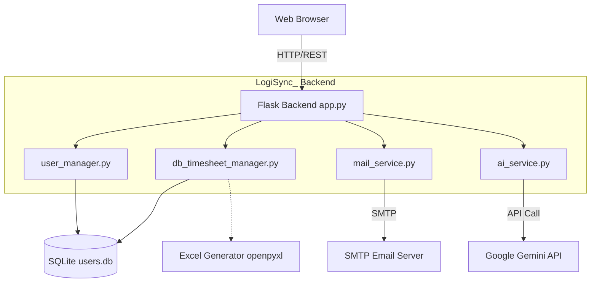
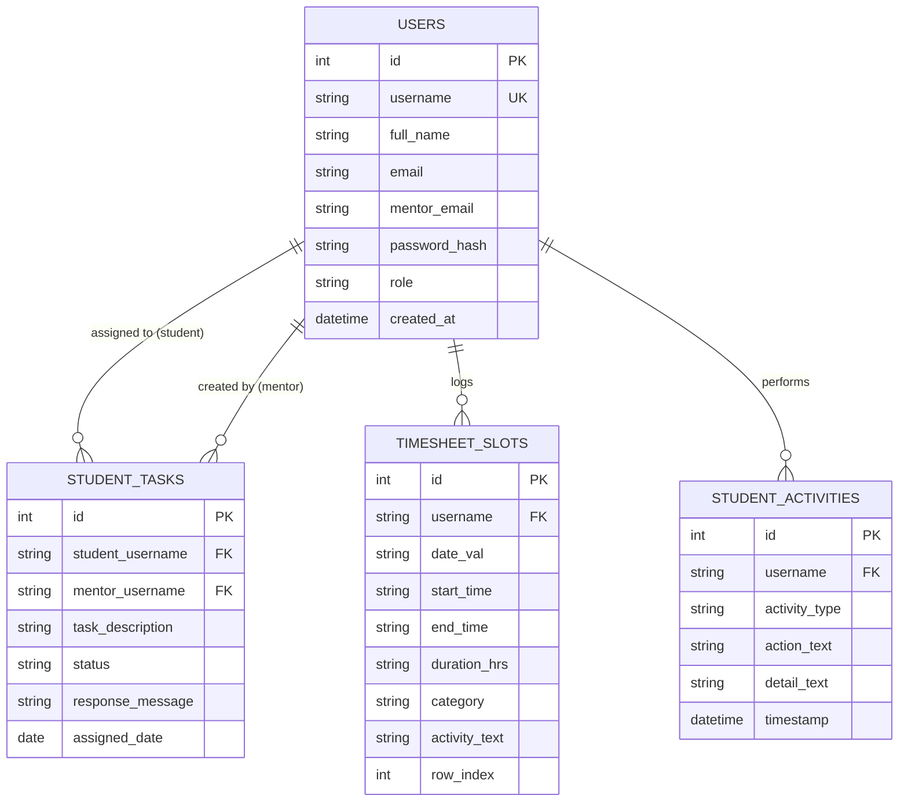
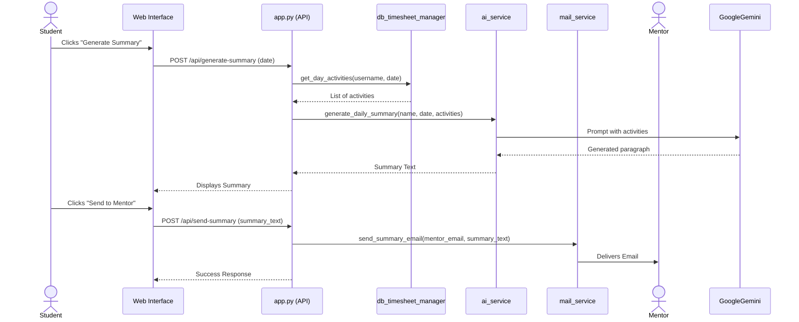
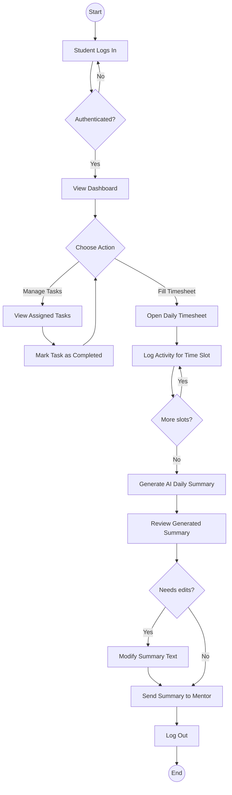

# LogiSync_ System Diagrams

This document contains visual representations of the LogiSync_ architecture, database schema, and key workflows using Mermaid.js.

## 1. System Architecture

The following diagram illustrates the high-level architecture of LogiSync_, showing how the client interacts with the Flask backend and how the backend integrates with various services and the database.

## 2. Database Entity Relationship Diagram (ERD)

This ERD displays the core tables in `users.db` and their relationships. The system relies heavily on the `users` table to link tasks, timesheets, and activities to specific students and mentors.

## 3. Sequence Diagram: AI Summary Generation & Delivery

This sequence diagram outlines the workflow when a student generates an AI summary of their day's activities and emails it to their mentor.

## 4. Activity Diagram: Student Daily Workflow

This activity diagram (flowchart) illustrates the typical daily process a student follows when interacting with LogiSync_.

