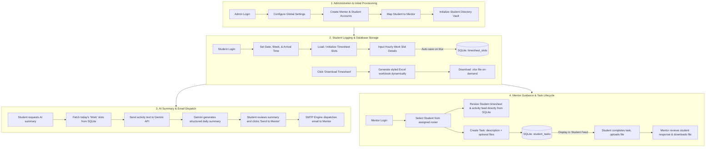

# LogiSync 🔄 — System Workflow Documentation

This document describes the step-by-step workflows, data flows, and interactive pipelines within **LogiSync**, demonstrating how administrators, students, and mentors interact with the system.

---

## 🗺️ System Workflow Map

The following diagram illustrates the complete user lifecycle and functional pipelines in LogiSync:

---

## 📋 Detailed Step-by-Step Workflows

### 1. Administration & Account Provisioning
Managed by: [app.py](file:///c:/Users/gauth/OneDrive/Desktop/LogiSync_/app.py) (Admin routing endpoints) and [user_manager.py](file:///c:/Users/gauth/OneDrive/Desktop/LogiSync_/modules/user_manager.py).
1. **Administrative Login**: Admin enters the portal and maps basic configurations (e.g. startup date, SMTP settings, directory root path).
2. **Account Creation**: The administrator registers Mentors and Students. Passwords are encrypted using Werkzeug's `generate_password_hash` helper.
3. **Relationship Mapping**: Admin maps student usernames to their corresponding mentors' emails in the database.
4. **Workspace Initialization**: Admin triggers folder creation. This:
   - Creates a physical directory structure under `excel_templates/<student_username>/` on the hosting filesystem (used for file vault uploads).
   - Generates the initial empty template logheet: [modules/excel_manager.py](file:///c:/Users/gauth/OneDrive/Desktop/LogiSync_/modules/excel_manager.py).

---

### 2. Daily Logging & Database Storage Pipeline
1. **Load Timesheet**: The student selects a calendar date, week, and day. Clicking *Load Timesheet* triggers a POST request to `/api/load-timesheet`.
2. **Retrieve/Generate Slots**: [modules/db_timesheet_manager.py](file:///c:/Users/gauth/OneDrive/Desktop/LogiSync_/modules/db_timesheet_manager.py) fetches existing database entries or populates new ones in SQLite based on the user's arrival time, inserting standard slots (including Lunch Break).
3. **Draft Slot Inputs**: The student enters detailed logs into work slot text areas.
4. **Auto-Save (Blur Event)**: Tabbing out or clicking away from a slot sends a request to `/api/save-slot`. The server updates the database row in the SQLite `timesheet_slots` table directly. No changes are written to the physical Excel file during daily logging.
5. **On-Demand Excel Export**: Clicking the *Download Timesheet* button triggers `/api/download-timesheet`. The database manager retrieves all logs for the current student from SQLite and compiles them dynamically into a styled Excel workbook (`.xlsx`) matching the corporate layout.

---

### 3. AI Summarization & Mailing Pipeline
1. **Aggregate Activities**: The student clicks *AI Daily Summary* on the dashboard. The system fetches the student's logged daily work activities directly from SQLite.
2. **API Prompting**: [modules/ai_service.py](file:///c:/Users/gauth/OneDrive/Desktop/LogiSync_/modules/ai_service.py) fetches all non-empty work slot strings, formats a prompt, and queries Google Gemini.
3. **Review**: The returned summary renders in a text preview box where students can read or customize it.
4. **SMTP Send**: Clicking *Send Summary to Mentor* compiles the email. [modules/mail_service.py](file:///c:/Users/gauth/OneDrive/Desktop/LogiSync_/modules/mail_service.py) logs into the SMTP server and dispatches it to the mapped mentor's email address.

---

### 4. Tasks & Collaboration Lifecycle
1. **Assign Task**: Mentors click *Assign Task* on their student viewer panel. It stores a pending task description in the SQLite `student_tasks` database table.
2. **Submit Progress**: The student views the pending task, enters progress comments, uploads an optional attachment, and clicks *Mark Completed*. The file is saved in `static/uploads/tasks/`.
3. **Verification**: The task status in the database shifts to `completed`. The mentor reviews the comments and downloads the student's work from their dashboard interface.
